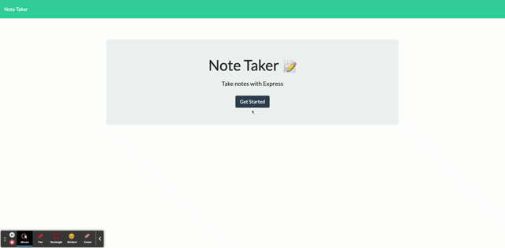

# 11 - Note Taker Application

## Description

This application uses Express within the server.js file back end, and saves and retrieves note data from a JSON file.
The application can be deployed in Heroku.


```
A small business owner can write and save notes, to organize and keep track of thoughts or tasks.

When opening the application, the user:
- Is presented with a landing page with a link to a notes page
- Can click on the link to the notes page where:
    * On the navigation on the top of the page:
        - The user can add a new note by clicking on the + add icon and filling out the Note Title and Note Text empty fields with information
        - Save new created note by clicking the save icon
    * On the right column:
        - The user can add Note Title/Text when creating a note
        - Can read Note Title/Text when revisiting from history a note
    * On the left column:
        - Revisit saved notes
            Where on click to the particular note:
            - It opens on the right column with the Note Title and the Note text
        - Option to delete a particular note by clicking the delete icon
```


## Mock-Up

The following animation shows the web application's appearance and functionality: 




## Link to the application:

## Heroku
[Heroku App](https://arcane-temple-47542.herokuapp.com/)

## GitHub
[GitHub Repo](https://github.com/adina-hc/11-note-taker)


